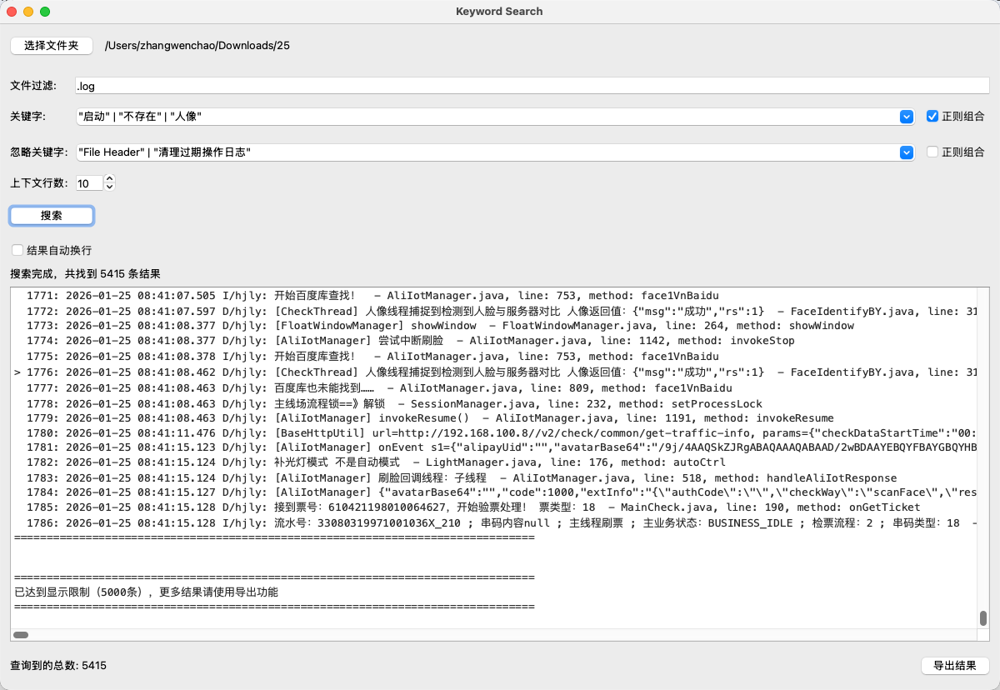

# TextSearcher

[English](#english) | [中文](#中文)

---

<a id="中文"></a>
## 中文

### 简介

TextSearcher 是一款基于 PySide6 的桌面应用程序，用于在指定目录下的文本文件中搜索关键字。它能够自动检测文件编码（使用 `chardet`），并显示匹配的行及其文件路径和行号。



### 主要功能

- **文件夹搜索** - 递归搜索指定文件夹下的所有文件
- **文件过滤** - 支持按文件扩展名过滤（如 `.log`）
- **关键字搜索** - 支持普通关键字和逻辑表达式搜索
- **忽略关键字** - 支持排除包含特定关键字的结果
- **上下文显示** - 可配置显示匹配行前后的上下文行数
- **搜索历史** - 自动记录最近使用的关键字和忽略关键字
- **结果导出** - 将搜索结果导出为文本文件
- **多线程搜索** - 支持取消正在进行的搜索操作

### 安装依赖

```bash
pip install PySide6 chardet
```

### 使用方法

#### 1. 启动应用

直接运行 Python 脚本：

```bash
python text_searcher.py
```

或运行已构建的应用程序：

```bash
open dist/TextSearcher.app
```

#### 2. 选择搜索文件夹

点击「选择文件夹」按钮，选择要搜索的目录。

#### 3. 设置搜索条件

| 设置项 | 说明 |
|--------|------|
| 文件过滤 | 输入文件扩展名（如 `.log`），留空表示不过滤 |
| 关键字 | 输入要搜索的关键字，支持下拉选择历史记录 |
| 正则组合 | 启用后支持逻辑运算符：`and`、`or`、`&`、`\|`、`not("x")` |
| 忽略关键字 | 输入要排除的关键字，留空表示不忽略 |
| 上下文行数 | 设置显示匹配行前后的行数（0-1000），设为 0 只显示匹配行 |

#### 4. 逻辑表达式搜索

启用「正则组合」后，可以使用以下运算符：

- `and` 或 `&` - 逻辑与
- `or` 或 `\|` - 逻辑或
- `not("x")` 或 `!("x")` - 逻辑非

示例：
```
"error" and "warning"
"error" | "warning"
"error" & "warning" & not("test")
```

#### 5. 执行搜索

点击「搜索」按钮开始搜索，搜索过程中按钮会变为「取消」，可随时中止搜索。

#### 6. 查看和导出结果

- 搜索结果会在下方结果框中实时显示
- 勾选「结果自动换行」可切换显示模式
- 点击「导出结果」可将搜索结果保存为文本文件

### 构建独立应用

使用 PyInstaller 构建 macOS 应用程序：

```bash
pyinstaller text_searcher.spec
```

构建产物：
- `build/text_searcher/` - 构建临时文件
- `dist/TextSearcher.app` - macOS 应用程序包
- `TextSearcher.dmg` - macOS 磁盘映像安装包

---

<a id="english"></a>
## English

### Introduction

TextSearcher is a desktop application based on PySide6 for searching keywords across text files in a selected directory. It automatically detects file encodings using `chardet` and displays matching lines with file paths and line numbers.


### Key Features

- **Folder Search** - Recursively search all files in a specified folder
- **File Filter** - Filter files by extension (e.g., `.log`)
- **Keyword Search** - Support for simple keywords and logical expression search
- **Ignore Keywords** - Exclude results containing specific keywords
- **Context Display** - Configure the number of context lines to show around matches
- **Search History** - Automatically record recent keywords and ignore keywords
- **Export Results** - Export search results to a text file
- **Multi-threaded Search** - Support for canceling ongoing search operations

### Installation

```bash
pip install PySide6 chardet
```

### Usage

#### 1. Launch the Application

Run directly with Python:

```bash
python text_searcher.py
```

Or run the built application:

```bash
open dist/TextSearcher.app
```

#### 2. Select Search Folder

Click the "Choose Folder" button to select the directory you want to search.

#### 3. Configure Search Settings

| Setting | Description |
|---------|-------------|
| File Filter | Enter file extension (e.g., `.log`), leave empty to search all files |
| Keyword | Enter the keyword to search, supports dropdown history |
| Logical Expression | Enable to support logical operators: `and`, `or`, `&`, `\|`, `not("x")` |
| Ignore Keyword | Enter keywords to exclude, leave empty to not ignore any |
| Context Lines | Set number of lines to show before/after matches (0-1000), 0 for match-only |

#### 4. Logical Expression Search

When "Logical Expression" is enabled, you can use the following operators:

- `and` or `&` - Logical AND
- `or` or `\|` - Logical OR
- `not("x")` or `!("x")` - Logical NOT

Examples:
```
"error" and "warning"
"error" | "warning"
"error" & "warning" & not("test")
```

#### 5. Execute Search

Click the "Search" button to start searching. During search, the button becomes "Cancel" to allow aborting the operation.

#### 6. View and Export Results

- Search results are displayed in real-time in the result box below
- Check "Auto-wrap results" to toggle display mode
- Click "Export Results" to save search results as a text file

### Building Standalone Application

Build the macOS application bundle using PyInstaller:

```bash
pyinstaller text_searcher.spec
```

Build artifacts:
- `build/text_searcher/` - Build temporary files
- `dist/TextSearcher.app` - macOS application bundle
- `TextSearcher.dmg` - macOS disk image installer

---

### License

MIT License
